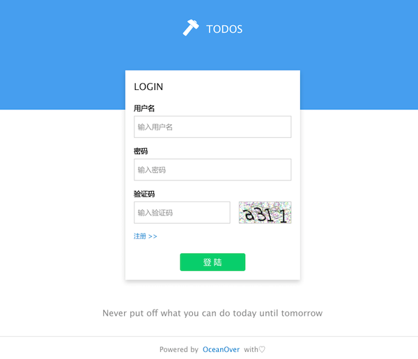

# todo-restful
a demo with front-end and server-side (inspire by todoMVC)

### 简介
todo-restful 是使用 Node.js + MongoDB + Express + 客户端框架开发的前后端分离的todo项目.

点击访问[Demo](http://121.42.186.45:8800)

### 环境
```
node.js 6.9.1
mognodb 3.4.1
express 4.0+
redis 3.2.2
```
### 运行
```
$ git clone git@github.com:OceanOver/todo-restful.git
$ cd todo-restful
$ npm install
```
visit `http://localhost:3000/index.html`

客户端使用Amaze UI搭建，对应`public/client`,构建开发工作流参见[amazeui/starter-kit](https://github.com/amazeui/starter-kit/tree/browserify)




